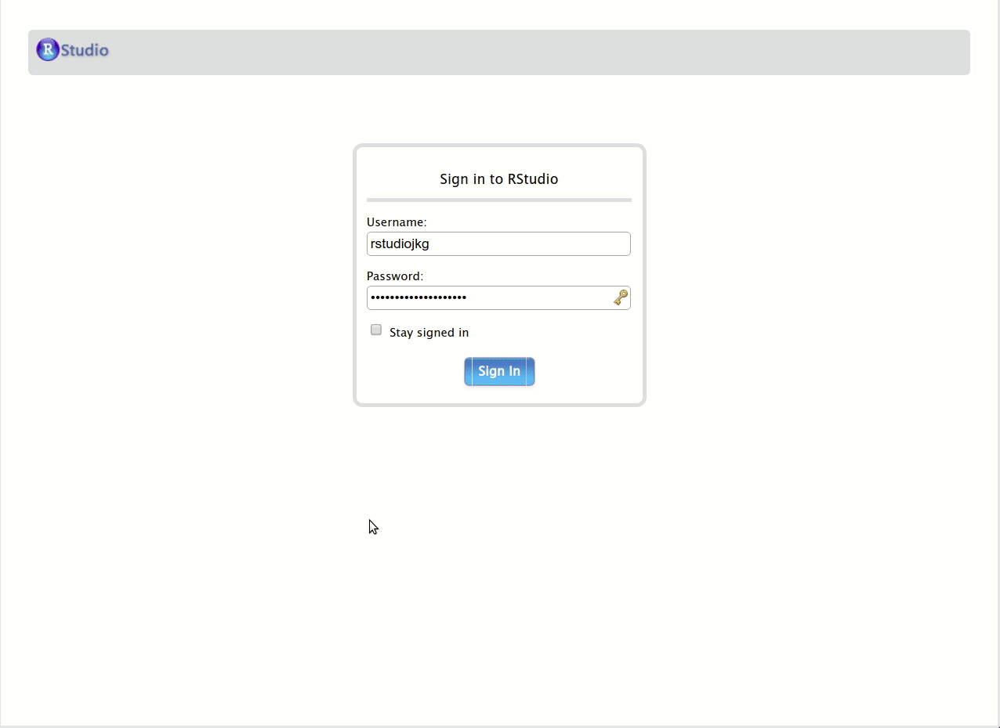
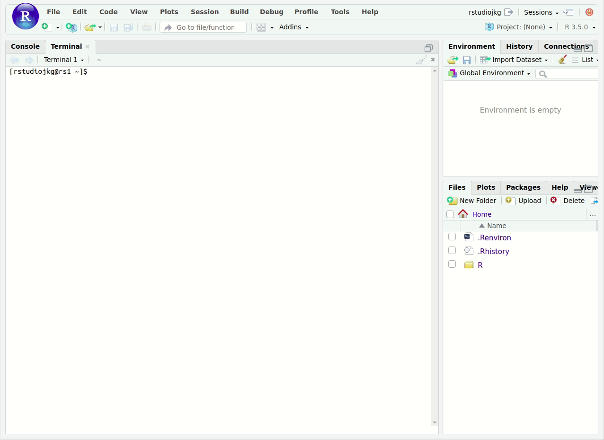
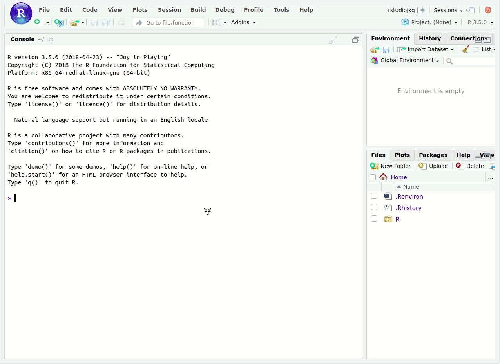
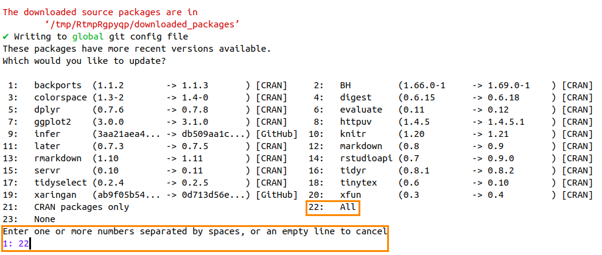
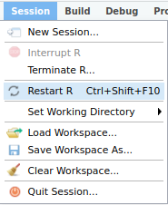

# RStudio Server Initial Configuration

*   [Overview](#overview)
*   [Prerequisites](#prerequisites)
*   [Instructions](#instructions)
    *   [How to change your temporary password](#how-to-change-your-temporary-password)
    *   [Changing global options](#changing-global-options)
    *   [Cloning this repository and running the configuration script](#cloning-this-repository-and-running-the-configuration-script)
*   [License](#license)

## Overview

A set of helper functions to help you configure RStudio Server for use in CDS 101.
RStudio Server is a web-app version of RStudio, a full-featured editor for R with a user-friendly design.

## Prerequisites

To be able to use RStudio Server, you must:

*   Be a student at George Mason University and registered for CDS 101.

*   Using a laptop or desktop computer with a working internet connection that has up-to-date versions installed of either [Google Chrome](https://www.google.com/chrome/) (recommended) or [Mozilla Firefox](https://www.mozilla.org/en-US/firefox/).
    *The RStudio Server page may not render correctly if you access it using Apple Safari, Microsoft Edge, and Internet Explorer, or if you try to access it using a phone or tablet.*
    
## Instructions

Navigate to RStudio Server <https://rstudio.cos.gmu.edu> using your web browser and login using your NetID and password.
If this is the first time you are logging in, you will need to use the temporary password that was shared with you.
If you cannot login, please post a message in the [\#r-rstudio-github-help](https://sp19-masoncds101.slack.com/messages/CFJKJV97T) Slack channel.

### How to change your temporary password

The first thing you should do after logging in is change your temporary password.
To do this, open up a terminal window by clicking `Tools → Shell...` in the top menu bar:



You should now see the command line.
To change your password, enter the command:

```bash
passwd
```

You will then see the following message:

    Changing password for user USERNAME.
    Changing password for USERNAME.
    (current) UNIX password:
    
Note that the word "USERNAME" in the above message is a placeholder, when you type it you will see your NetID.
When you see this message, type in your password, followed by <kbd>Enter</kbd>.
**You will not see the cursor move when you type, this is okay and the expected behavior.**
If you entered your password correctly, you will then see:

    New password:
    
Type in what you want your new password to be, then hit <kbd>Enter</kbd>.
You'll then see:

    Retype new password:

Re-enter your password as directed, followed by <kbd>Enter</kbd>.
If you didn't make a mistake in typing your new password, you'll then see:

    passwd: all authentication tokens updated successfully.

If you don't see this message, then there was a typo somewhere and your password was not changed, so you will need to type in `passwd` and try again.



### Changing global options

To change the settings for RStudio Server, click `Tools → Global Options...` in the top menu bar.
A pop-up menu will appear with many different options for you to change.
You are free to explore all the different options on your own.
For now, there are two things you should change:

1.  Uncheck the box next to **Restore .RData into workspace at startup**

2.  Click the drop-down menu next to **Save workspace to .RData on exit** and change the setting to *Never*

Click the **Apply** button on the lower-right of the pop-up window, followed by the **OK** button.



### Cloning this repository and running the configuration script

After you've changed your temporary password and disabled the `.RData` file, the next step is to clone this repository as a new project in RStudio Server.
To do this, click on the **New Project** button, then **Version Control**, then **Git**, and then paste <https://github.com/mason-sp19-cds-101-001/rstudio-server-initial-configuration.git> into the *Repository URL* box, and finally click **Create Project**.


After the repository is cloned, you should see the following files in the file browser window in the lower right of RStudio Server.


Confirm that a file named `config_rstudio_server.R` is visible in that window, then type the following in the R Console window:

```r
source("config_rstudio_server.R")
```

This will load helper functions into your R environment.
Next, type the following in the R Console to begin the configuration procedure:

```r
configure_rstudio()
```

When you run the above function, you will see input prompts asking for the following information:

    Enter your first name:
    Enter your last name:
    Enter your email address:

Input your information and verify that it is correct, then wait for the configuration and installation procedure to complete, which will take a few minutes.

During installation, you might see the message:

    These packages have more recent versions available.
    Which would you like to update?
    
This is then followed by a numbered list of package names.
If you see this, locate the number that has *All* to the right of it.
For example, in the image below, that number is 22:



Type this number (in the example, we'd type <kbd>2</kbd><kbd>2</kbd>), then press <kbd>Enter</kbd>.
The installation procedure should resume.

Once the installation procedure is complete, look for **Session** in the top menu bar, click it, and then click *Restart R* in the drop-down menu.



RStudio Server is now configured for use in CDS 101!

## License

[MIT](https://opensource.org/licenses/MIT)
