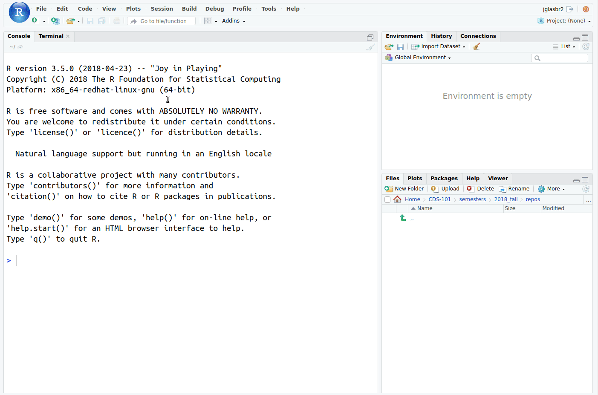
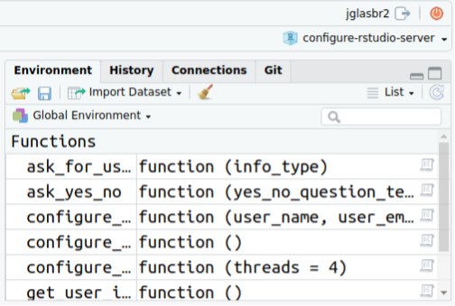

RStudio Server Initial Configuraiton
====================================

Overview
--------

A set of helper functions to help you configure RStudio Server for use in CDS 101.
RStudio Server is a web-app version of RStudio, a full-featured editor for R with a user-friendly design.

Prerequisites
-------------

To be able to use RStudio Server, you must:

*   Be a student at George Mason University and registered for CDS 101.

*   Using a laptop or desktop computer with a working internet connection that has up-to-date versions installed of either [Google Chrome](https://www.google.com/chrome/) (recommended) or [Mozilla Firefox](https://www.mozilla.org/en-US/firefox/).
    *The RStudio Server page may not render correctly if you access it using Apple Safari, Microsoft Edge, and Internet Explorer, or if you try to access it using a phone or tablet.*
    
Instructions
------------

Navigate to RStudio Server at <https://rstudio.cos.gmu.edu> and login using your NetID and password.
If you cannot login, please post a message in the [\#r-rstudio-github-help](https://sp19-masoncds101.slack.com/messages/CFJKJV97T) Slack channel.
Once you are logged in, clone this repository as a new project in RStudio Server by clicking on the **New Project** button, then **Version Control**, then **Git**, and then paste <https://github.com/mason-sp19-cds-101-001/rstudio-server-initial-configuration.git> into the *Repository URL* box, and finally click **Create Project**.



After the repository is cloned, you should see the following files in the file browser window in the lower right of RStudio Server.


Confirm that a file named `config_rstudio_server.R` is visible in that window, then type the following in the R Console window:

```r
source("config_rstudio_server.R")
```

This will load helper functions into your R environment.
Next, type the following in the R Console to begin the configuration procedure:

```r
configure_rstudio()
```

When you run the above function, you will see input prompts asking for the following information:

    Enter your first name:
    Enter your last name:
    Enter your email address:

Input your information and verify that it is correct, then wait for the configuration and installation procedure to complete, which will take a few minutes.

Once the installation procedure is complete, click the red button — it says **Quit the current R session** if you hover your mouse over it — on the upper right of the page to refresh RStudio Server.



RStudio Server is now configured for use in CDS 101!

License
-------

[MIT](https://opensource.org/licenses/MIT)
